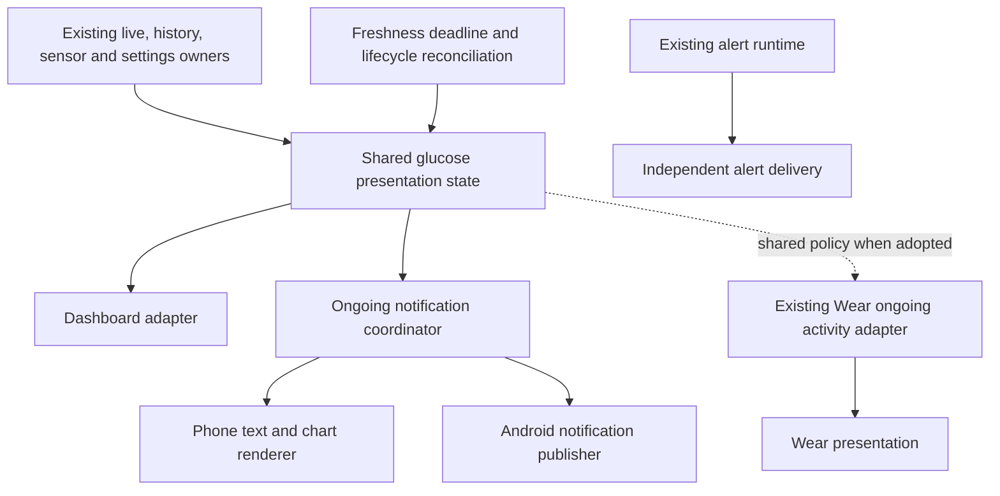

# Notification modernization proposal

Status: proposed feature plan, not a change to the structural track order in
[direction.md](direction.md). Prepared 2026-09-27 against local `main` at
`40f000f3e`. Source review only; no device reproduction or timing measurements yet.

## Outcome

Make the ongoing notification a timely, accessible view of the same resolved
glucose state as the dashboard, with explicit freshness and useful compact and
expanded layouts. It must work with the activity closed and after process restart.
Preserve the independent delivery and safety behavior of glucose alarms.

The first deliverable is correct startup and aging. The second is coordinated
updates. The third is visual modernization. Animation alone cannot repair the
first two, and the visual work should not require a rewrite of all of `Notify`.

## Evidence in the current code

Paths below are relative to `Common/src/` at the inspected commit.

| Finding | Evidence | Consequence |
| --- | --- | --- |
| Startup has its own rendering and fallback policy | `main/java/tk/glucodata/Notify.java`, `getforgroundnotification()` | It chooses connection/exchange text from `SensorBluetooth.blueone != null`, explicitly draws the initial grid, and allows a separate 15-minute history fallback. This is not the same state policy as a normal update. |
| Missing current data can leave the previous notification in place | `showoldglucose()`, `glucoseRefreshRunnable`, `dataChangedGlucoseRefreshRunnable` | These paths return on an absent current snapshot instead of publishing an unavailable/stale state. This is a concrete gap, not proof of every reported device occurrence. |
| Status and data have different update routes | `main/java/tk/glucodata/UiRefreshBus.kt` | Data changes schedule notification work; `requestStatusRefresh()` emits to UI collectors and invalidates the floating view without scheduling notification work. |
| Persistence catch-up uses elapsed delays | `Notify.updateForegroundGlucoseNotification()` and refresh scheduling | A direct update schedules an interactive 750 ms follow-up; data changes use a resettable 1,000 ms delay. A burst can keep postponing the latter. Actual latency still needs measurement. |
| Deduplication omits visible state | `Notify.isSameForegroundGlucose()` | It compares time, primary value and rate, omitting sensor identity, status, peers, history corrections, settings and theme. Some callers bypass this gate, so effects depend on the route. |
| Live values are rasterized even with the system-font option | `Notify.makearrownotification()` | Both sizes call `NotificationChartDrawer.drawMultiGlucoseText()` and hide the text view. Arrows and charts also use bitmaps. |
| Relevant sharing already exists | `CurrentDisplaySource`, `DisplayTrendSource`, `DisplayDataState`, `NotificationChartModelSource` | Preserve these semantics rather than inventing notification-specific glucose/calibration logic. `DisplayDataState` already distinguishes no sensor, awaiting data, fresh and stale. |
| Some architecture work has already landed | `OngoingNotificationAccess`, `NotificationPredictionAccess`, variant `Specific.registerBridges()` | Extend the current registered-contract pattern. Do not redo the reflection work described as future work in the older direction document. |

`Notify.java` is 4,559 lines and `NotificationChartDrawer.java` is 2,587 lines.
Notification rendering, foreground-service integration, sound, retries, alarm
activities and channel setup share the first file. Extraction must preserve the
external entry points and separate changes to alert behavior from presentation.

## Product behavior

Keep reading freshness, transport state and history-loading state independent.
A sensor can reconnect while its last reading is still fresh. Being connected
does not prove that glucose is current. Loading failure is not empty history.

| Situation | Proposed presentation |
| --- | --- |
| Process starting, stores not ready | Brief “Restoring readings” service notification. No empty grid or invented connection claim. Promote the service promptly; restore asynchronously. |
| Fresh reading restored or received | Value, units, trend, measured delta where available, and reading age. Same value policy as the dashboard for the same sensor and display mode. |
| Sensor selected, no reading yet | “Waiting for first reading”, plus a verified warmup/connection reason if available. Show a chart only if history exists. |
| Fresh reading while reconnecting | Keep the valid reading and its age; show reconnecting as secondary information. |
| Last reading becomes stale | “No recent reading”; retain the actual previous value explicitly labeled “Last reading”, with its timestamp/age. Do not present its arrow or prediction as current. Keep truthful historical chart data. |
| No sensor selected | “No sensor selected”, with a route to sensor setup. Keep the service notification only when the service actually requires it. |
| Restore/query fails | Explicit temporary-unavailable state, logged failure and retry; do not silently convert an error into an empty sensor. |
| Reading resumes | Restore the fresh presentation from the next valid reading without opening the app or replaying old notification frames. |

This changes presentation only. It must not stop ingestion, discard readings,
rewrite history, infer expiry, change calibration or alter alarm thresholds.
Start with the existing shared freshness window (currently 330 seconds); changing
sensor-specific freshness policy is a separate decision. Remove the startup-only
15-minute exception through an explicit behavior-fix PR, not an extraction.

## Visual direction and motion

- Compact: one dominant value, readable units, a resource-based trend icon, and
  one short line for delta/age or exceptional status. Keep a compact sparkline
  available for existing chart users; do not let it squeeze essential text.
- Expanded: the same value and state, a larger restrained chart with target band,
  gaps and sensor ownership intact, and clearly labeled peer readings. Add a
  useful journal action; tapping the body already opens the dashboard.
- Use actual `TextView` content for values and labels, system-compatible text
  styles, restrained tonal accents and vector/resource icons. Prioritize font
  scaling and TalkBack over reproducing IBM Plex through bitmaps. Retain custom
  font choices only where they work reliably without bitmap text; document any
  preference migration explicitly.
- A glucose graph can remain a bounded bitmap in `RemoteViews`. Cache and render
  it separately; do not rasterize the entire notification just to carry a graph.
  Chart descriptions should summarize range, interval and freshness meaningfully.
- Keep semantic low/high colors distinct from decorative dynamic color. Verify
  the notification host's light/dark behavior rather than assuming the app theme
  matches System UI. Existing code already records OEM and dark-shade problems.
- Populate standard notification title/text as well as custom content, so
  listeners, accessibility and secondary surfaces receive useful text.
- Routine updates replace the same notification ID quietly. Use the reading's
  timestamp rather than render time. Use system-owned elapsed-time presentation
  where suitable; do not repost every second just to animate age.
- Let System UI control shade expansion and notification transitions. Do not
  promise Compose chart morphs or digit animations inside ordinary notifications.
  Rich Compose motion belongs in the notification-settings preview and in-app
  detail surface, respecting reduced-motion settings.

Android hosts custom notifications through a restricted `RemoteViews` view set;
Android 12+ applies system decoration and constrains available space. Repeated
`notify()` calls are also rate-limited. These are platform boundaries, not missing
Compose implementation work. Sources: [custom notification layouts][custom],
[RemoteViews][remote], [notification updates][updates].

Optional later experiment: API 37 `Notification.MetricStyle` provides native
metric presentation and may be a good chart-free mode. The project already uses
compile SDK 37, but runtime availability, decimal/locale handling, layout and
supported-device behavior must be checked. This is not a promise of animation.
[MetricStyle reference][metric].

Live Update promotion is a separate eligibility experiment. It disallows custom
`RemoteViews`, requires a qualifying ongoing activity, and is subject to user and
OEM control. Do not assume continuous CGM monitoring qualifies or replace alert
delivery with promotion. A chart-free native mode would need an ordinary ongoing
fallback. [Live Update requirements][live].

## Architecture fit

Use one module, package boundaries, manual registration at application startup,
and existing storage owners, as required by direction.md D2/D3 and P1/P4/P6.
The notification never depends on `DashboardViewModel` or activity lifecycle.

The concrete boundary has two real consumers: dashboard and ongoing notification.
Start by adapting `CurrentDisplaySource`, `DisplayDataState` and
`DisplayTrendSource`, not replacing their calculations. Preserve existing units
explicitly at adapter boundaries: some current snapshots already contain display
units. Do not introduce a second conversion or calibration pass.

Proposed responsibilities, with names to settle during the pilot:

- `glucose/presentation`: immutable snapshot containing sensor identity, reading
  identity/time, resolved values with explicit units/provenance, trend/delta,
  freshness, transport status, source readiness and revision information.
- `notifications/ongoing`: application/service-owned coordinator consuming live
  state, committed history changes, status, selection, calibration/display-mode,
  unit, smoothing, prediction and appearance changes. Own its lifecycle and
  cancellation explicitly; it must work before any activity is created.
- `notifications/rendering`: pure presentation mapping plus Android text/icon
  rendering and asynchronous chart work. Register variant-specific capabilities
  at startup; do not put phone-only resource dependencies in shared policy.
- Android publisher: stable ID/channel, service attachment, update ordering and
  successful-post bookkeeping. A visual refresh never triggers an alarm or
  rebroadcasts a glucose reading as a side effect.

Use serialized state reduction and a retained latest snapshot. An event bus with
no replay can be an invalidation adapter during migration, but is not the state
store. Reconcile a live reading with its eventual stored counterpart by identity
and provenance; history catch-up must not roll the displayed value backward.
Backfill should update chart history without replaying each reading as live.

Publish essential text promptly, with a bounded leading/trailing update policy
for ordinary bursts. Render charts off the main thread and conflate pending chart
work. A generation/revision check must prevent an older chart job from publishing
over newer units, sensor selection or reading state. Reuse a chart only while its
sensor, units, mode and history revision are compatible; otherwise omit it until
ready. Treat failed publication as retryable and advance the deduplication state
only after a successful post.

Schedule the next freshness transition even when no data arrives. Reconcile on
service restart, screen-on, time changes and other available wake events. Use
monotonic time for scheduling and the actual source timestamp for displayed age;
test clock rollback and future timestamps. Do not introduce frequent wakeups or
new exact alarms merely for visual animation. Measure Doze behavior and state the
actual timing bound; process suspension prevents a blanket real-time guarantee.

A complete render identity includes sensor/peer identities, values/timestamps,
freshness/status, settings revisions, history corrections and appearance. Chart
identity is narrower than text identity so an age-only update does not redraw it.

## Delivery sequence

Each row is a reviewable outcome; extraction and behavior changes are separate
PRs. Avoid a long stack of mechanical moves.

| Step | Deliverable | Acceptance |
| --- | --- | --- |
| N0: evidence and characterization | Capture startup, interruption and recovery traces; pin current resolver, rendering and alert-side-effect behavior with fake clock/publisher tests. Record baseline latency, posts and bitmap allocations. | Reproduce the reported symptoms or explicitly distinguish unobserved cases. Tests characterize real behavior, not source spelling. |
| N1: bounded reliability fixes | Correct startup status/fallback, publish stale/unavailable states, refresh on status changes, and reconcile age without requiring another reading. Fix incomplete deduplication and indefinite debounce where reproduced. | Cold start has no misleading empty-grid “Connecting”; a stopped feed cannot remain a fresh-looking value indefinitely; recovery works without the dashboard. Existing alarm tests remain green. |
| N2: structural pilot | Extract the ongoing presentation/coordinator/renderer/publisher seams from working code; keep legacy entry points as delegating adapters and retain existing behavior. Add package-boundary tests. | Characterization parity, application-start registration, no reflection or new storage owner; phone and Wear pass. |
| N3: shared state adoption | Dashboard and notification consume the shared resolved state; persistence/status/settings drive it. Remove proven redundant delays and direct dashboard-to-Notify refresh calls. Add revision-safe chart work. | Same sensor/mode yields matching value, units, trend and freshness; delayed history cannot overwrite newer live state; settings update while the activity is closed. |
| N4: visual replacement | Native text/icons, clearer compact/expanded hierarchy, accessible chart, sensible age and source labels, quiet stable updates. Modernize the Compose settings preview using production presentation models. | Both units/locales, large fonts, TalkBack, light/dark, compact/expanded/lock-screen layouts and multiple sensors pass visual checks. Chart cost does not delay the value. |
| N5: alert presentation follow-up | Apply the same visual vocabulary to existing alarm cards and action feedback, keeping their independent lifetime and delivery policy. Extract remaining alert concerns only in later structural PRs. | Snooze/dismiss actions target the right alert after cold start; low/high/loss, sound, DND, retries and foreground-service survival retain their established behavior. |

**Scheduling:** N0 and small N1 fixes can proceed during the current architecture
track under D4's bug-fix exception. N2/N3 require the structural slot to become
available or an explicit amendment to the plan of record. This proposal does not
declare that slot available. Use already-landed Q1 registration seams; do not
restart the parked SettingsStore track. Integrate with the Q2/Q3 settings registry
only when it exists. A small notification preference adapter is sufficient now.

## Validation and completion criteria

- Deterministic tests: no sensor, first reading, restore unavailable/error,
  stale deadline with no incoming events, reconnect with fresh data, history-only
  startup, delayed Room write, backfill, source handover with equal values,
  same-value status changes, peer changes, unit/mode/calibration changes,
  out-of-order chart completion, failed publication and clock changes.
- Preserve sensor provenance, sealed history, gaps, smoothing and calibration
  semantics in existing chart/current-display tests. Explicitly test mg/dL and
  mmol/L; display refresh must never write a new glucose reading.
- Keep `NotificationScreenOnTests`, chart smoothing/gap/prediction tests, and
  alert lifetime/value/silent-delivery regressions. Add portable policy tests to
  `src/test`; platform/phone-only tests follow the existing source-set split.
- For implementation PRs run both full suites:
  `:Common:testMobileDebugUnitTest :Common:testWearDebugUnitTest --no-daemon`.
  Shared-code changes compile both debug variants. Notification/resource/bridge
  changes also run both minified variants, matching current CI:
  `:Common:assembleMobileDebug :Common:assembleWearDebug
  :Common:assembleMobileRelease :Common:assembleWearRelease
  -PjugglucoAbi=arm64-v8a --no-daemon`.
  Arrange long native builds under the repository's approval rule. Report task
  results precisely; arm64 smoke is not all-ABI validation.
- Device matrix: oldest supported representative device, Android 12+ custom
  layout restrictions, current Pixel, at least one different OEM; screen off,
  lock screen, Doze, service restart/process recreation, reboot and denied
  notification permission. Exercise the app with no activity opened. Wear gets
  a real ongoing-activity/action smoke test for shared-path changes.
- Measure app-state-to-`notify()` and visible-shade latency separately. Proposed
  awake baseline target: p95 essential update within 500 ms of resolved state,
  final chart within 1 second on the agreed reference device; validate feasibility
  in N0 rather than claiming these as current performance. No starvation under
  continuous backfill, stale chart overwrite, or chart work on the main thread.
- Track render duration, allocation/bitmap bytes, redraw count and wakeups using
  a repeatable workload. Age-only updates must not allocate a new chart. Compare
  before/after battery and idle behavior rather than introducing a frame timer.
- Preserve channel IDs and user-controlled importance/sound settings. Any channel
  migration is an explicit behavior change. Translate new strings in every
  supported locale. Add a lock-screen privacy option without silently changing
  existing user choices.

The modernization is complete when the notification follows the same resolved
reading state with the activity closed, ages honestly when input stops, restores
without misleading startup content, remains readable and accessible across
supported devices, and has measured update/allocation improvements without alert
regressions. A newer layout alone does not meet that definition.

[custom]: https://developer.android.com/develop/ui/views/notifications/custom-notification
[remote]: https://developer.android.com/reference/android/widget/RemoteViews
[updates]: https://developer.android.com/develop/ui/compose/notifications/create-notification#Updating
[metric]: https://developer.android.com/reference/android/app/Notification.MetricStyle
[live]: https://developer.android.com/develop/ui/views/notifications/live-update
